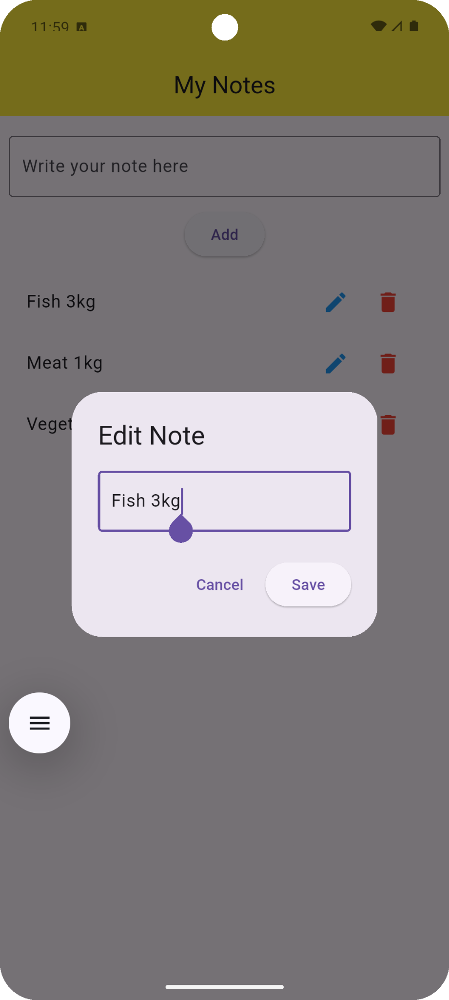

# 📝 Basic Notes App

A simple Flutter notes app with add, edit, delete and persistent local storage using SharedPreferences.

---

## ✨ Features
- ➕ Add notes with a simple input field
- ✏️ Edit existing notes through a popup dialog
- 🗑 Delete notes instantly
- 💾 Persistent local storage (notes stay after app restart)
- 🎨 Clean Material UI

---

## 📸 Screenshots

| Home Screen                                 | Edit Dialog                                 |
|---------------------------------------------|---------------------------------------------|
|  |  |

---

## 🛠 Tech Stack
- **Flutter** (Dart)
- **SharedPreferences** for local storage

---

## 🚀 How to Run
```bash
git clone <repo-link>
cd <project-folder>
flutter pub get
flutter run
